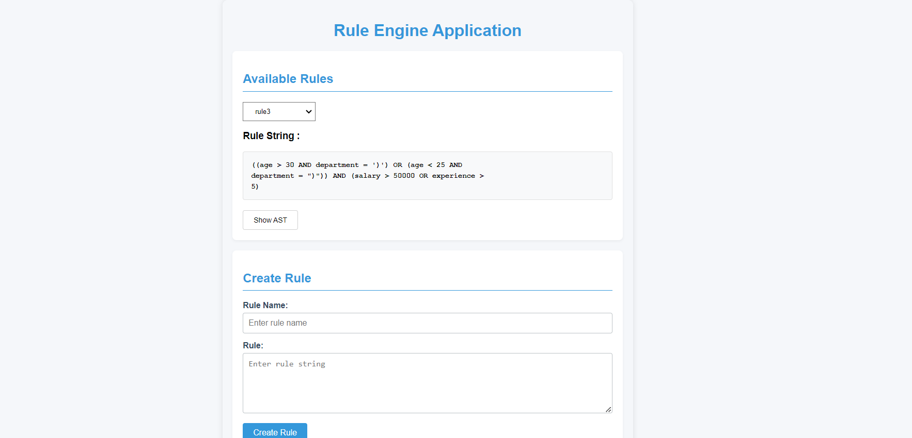

# Rule Engine AST Parser and Evaluator

Welcome to the **Rule Engine AST Parser and Evaluator** project! This application allows you to create, combine, and evaluate custom rules using a user-friendly interface. It parses rule strings into an Abstract Syntax Tree (AST), validates attributes, and evaluates rules against provided data with type safety.

## Table of Contents

- [Rule Engine AST Parser and Evaluator](#rule-engine-ast-parser-and-evaluator)
  - [Table of Contents](#table-of-contents)
  - [Features](#features)
  - [Demo](#demo)
  - [Getting Started](#getting-started)
    - [Prerequisites](#prerequisites)
    - [Installation](#installation)
    - [Environment Variables](#environment-variables)
    - [Running the Application](#running-the-application)
  - [Usage](#usage)
    - [Creating a Rule](#creating-a-rule)
    - [Viewing Available Rules](#viewing-available-rules)
    - [Combining Rules](#combining-rules)
    - [Evaluating a Rule](#evaluating-a-rule)
  - [API Reference](#api-reference)
    - [tRPC Procedures](#trpc-procedures)
  - [License](#license)
  - [Acknowledgments](#acknowledgments)

---

## Features

- **Create Rules**: Define custom rules using a simple syntax.
- **Combine Rules**: Merge multiple rules using logical operators (`AND`, `OR`).
- **Evaluate Rules**: Test rules against input data to see if they pass or fail.
- **AST Visualization**: View the Abstract Syntax Tree in a formatted tree structure.
- **Attribute Management**: Automatically adds missing attributes to the catalog.
- **Type Safety**: Ensures strict type checking during evaluation.
- **User-Friendly Interface**: Simple forms to interact with the rule engine.

---

## Demo



---

## Getting Started

### Prerequisites

- **Node.js**: Ensure you have Node.js installed (version 14 or higher recommended).
- **Yarn**: This project uses Yarn as the package manager.
- **MongoDB**: A running MongoDB instance is required for storing rules and attributes.

### Installation

1. **Clone the Repository**

   ```bash
   git clone https://github.com/manav-gopal/rule-engine-ast.git
   cd rule-engine-ast
   ```

2. **Install Dependencies**

   ```bash
   yarn install
   ```

### Environment Variables

Create a `.env` file in the root directory and add the following variables:

```env
MONGODB_URI=mongodb://localhost:27017/rule-engine
PORT=3000
```

- **MONGODB_URI**: Connection string for your MongoDB instance.
- **PORT**: Port number on which the application will run.

### Running the Application

Start the development server:

```bash
yarn dev
```

The application will be running at `http://localhost:3000`.

---

## Usage

### Creating a Rule

1. Navigate to the **Create a New Rule** section.
2. Enter a **Rule Name** (unique identifier for the rule).
3. Enter the **Rule** string using the supported syntax.

   - **Syntax Example**:

     ```js
     (age > 30 AND department = 'Sales') OR (age < 25 AND department = 'Marketing')
     ```

4. Click **Create Rule**.
5. The application will parse the rule, validate attributes, and display the formatted AST.

### Viewing Available Rules

- Navigate to the **Available Rules** section.
- Select a rule from the dropdown menu.
- The **Rule String** for the selected rule will be displayed.

### Combining Rules

1. Navigate to the **Combine Rules** section.
2. Enter the names of the rules you wish to combine, separated by commas.
   - Example: `Rule1, Rule2, Rule3`
3. Select the **Combine Operator** (`AND` or `OR`).
4. Click **Combine Rules**.
5. The combined rule's AST will be displayed.

### Evaluating a Rule

1. Navigate to the **Evaluate Rule** section.
2. Enter the **Rule Name** you wish to evaluate.
3. Provide the **Evaluation Data** as a JSON object.

   - Example:

     ```json
     {
       "age": 35,
       "department": "Sales",
       "salary": 60000,
       "experience": 7
     }
     ```

4. Click **Evaluate Rule**.
5. The result will indicate whether the rule passed or failed evaluation.

---

## API Reference

### tRPC Procedures

- **createRule**

  - **Description**: Creates a new rule by parsing the rule string and storing it in the database.
  - **Input**:

    ```typescript
    {
      ruleName: string;
      ruleString: string;
    }
    ```

  - **Output**:

    ```typescript
    {
      ast: Node;
      formattedAST: string;
    }
    ```

- **getRules**

  - **Description**: Retrieves all available rules from the database.
  - **Output**:

    ```typescript
    Array<{
      name: string;
      ruleString: string;
    }>;
    ```

- **combineRules**

  - **Description**: Combines multiple rules into one using the specified operator.
  - **Input**:

    ```typescript
    {
      ruleNames: string[];
      options: {
        operator: 'AND' | 'OR';
      };
    }
    ```

  - **Output**:

    ```typescript
    Node;
    ```

- **evaluateRule**

  - **Description**: Evaluates a rule against provided data.
  - **Input**:

    ```typescript
    {
      ruleName: string;
      data: Record<string, unknown>;
    }
    ```

  - **Output**:

    ```typescript
    string; // "Passed Evaluation" or "Failed Evaluation" or error message
    ```

---

## License

This project is licensed under the **MIT License**. See the [LICENSE](./LICENSE) file for details.

---

## Acknowledgments

- **[Next.js](https://nextjs.org/)**: A React framework for building server-side rendered applications and static websites.
- **[React](https://reactjs.org/)**: A JavaScript library for building user interfaces.
- **[TypeScript](https://www.typescriptlang.org/)**: Typed superset of JavaScript.
- **[tRPC](https://trpc.io/)**: End-to-end typesafe APIs made easy.
- **[MongoDB](https://www.mongodb.com/)**: A source-available cross-platform document-oriented database program.
- **[Yarn](https://yarnpkg.com/)**: Fast, reliable, and secure dependency management.

---

Thank you for using the Rule Engine AST Parser and Evaluator! If you have any questions or feedback, please feel free to open an issue.
